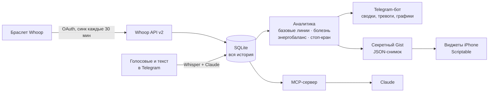

<div align="center">

# Whoop Loop

**Браслет Whoop даёт цифры. Whoop Loop превращает их в решения.**

Личный ИИ-аналитик здоровья поверх Whoop API: замечает ранние признаки
болезни по отклонению от *вашей* нормы, считает настоящий расход калорий
вместо оценки браслета и каждое утро говорит, как прожить этот день.
Весь интерфейс — Telegram-бот и виджеты на iPhone.


<sub>Виджеты на демо-данных: восстановление, сон, нагрузка, тревожный режим, экран блокировки.</sub>

</div>

---

*English: a personal health analyst on top of the Whoop API — early illness
warnings from personal baselines, self-calibrating calorie targets, a morning
brief, iPhone widgets and an MCP server for Claude. The bot speaks Russian.*

## Зачем это

Приложение Whoop показывает восстановление 47% — и что с этим делать, решать
вам. Whoop Loop отвечает на вопросы, ради которых браслет вообще покупают:

- **Я заболеваю?** Пульс покоя, температура кожи и дыхание обычно сдвигаются
  раньше, чем появляется насморк. Бот сравнивает их не со средними по
  больнице, а с вашей личной нормой за 4 недели.
- **Сколько мне на самом деле есть?** Расход калорий от Whoop ошибается
  систематически. Бот раз в неделю сверяет его с реальным изменением веса и
  вычисляет поправку — через 3–4 недели цель по калориям становится вашей.
- **Тяжёлый день или разгрузка?** Утренняя сводка собирает сон, восстановление,
  нагрузку и питание в одну рекомендацию.

## Утро с Whoop Loop

Каждое утро, как только Whoop оценил ночь, в Telegram приходит одно сообщение
(пример на демо-данных):

```
Доброе утро. 9 октября, пятница

🟡 Восстановление: 47% — жёлтая зона
   HRV 62 мс (+6 к норме), пульс покоя 52 (−4 к норме)

😴 Сон: 8ч 32м — качество 59%
   глубокий 1ч 53м, быстрый 2ч 03м, пробуждений 9

🍽 Цель на сегодня: 2 199 ккал (снижение)
   расход ≈ 2 749 ккал, коэффициент ещё не откалиброван
   съедено 2 091, осталось 108 · белок 154/140 г
⚖️ Вес: 77.9 кг (сглаженный тренд 77.7, ↓ 0.40 кг/нед)

Сегодня: обычный день. Прогулка в удовольствие, работа без героизма,
и постарайся лечь раньше обычного.
```

Если ночь ещё не подтверждена в приложении Whoop, бот не выдаёт вчерашние
цифры за сегодняшние, а ждёт и напоминает подтвердить сон.

## Что внутри

| | |
|---|---|
| 🩺 **Раннее предупреждение о болезни** | Личные базовые линии по 6 показателям, тревога при одновременном отклонении нескольких |
| ⚖️ **Калории с самокалибровкой** | Настоящий расход из энергобаланса: еда − изменение веса × 7700 |
| 🛑 **Стоп-кран дефицита** | Если на диете падает HRV, растёт пульс и портится сон — бот советует поднять калории |
| 🌅 **Утренняя сводка и вечерний план** | Что делать сегодня; во сколько лечь, чтобы завтра восстановиться |
| 🎙 **Голосовой дневник** | «Съел плов, два кофе, лёг в два» → структурированная запись (Whisper + Claude) |
| 📱 **Виджеты для iPhone** | Главный экран и экран блокировки, три страницы, тревожный режим, серии |
| 📈 **Графики** | PNG прямо в чат: вес, энергия, восстановление, сон, панель здоровья |
| 🤖 **MCP-сервер** | Claude отвечает на вопросы о вашем здоровье по вашим же данным |

## Как это устроено



Бот работает на long polling, поэтому сервер **не открывает наружу ни одного
порта**. Виджет не может спросить сервер напрямую, поэтому бот раз в 15 минут
выкладывает короткий снимок в секретный Gist, а виджет читает его оттуда.

## Как бот замечает болезнь


1. **Личная норма.** Для каждого показателя берутся последние 28 дней, кроме
   двух последних (чтобы начинающаяся болезнь не испортила норму).
   Центр — медиана, разброс — MAD × 1.4826: одна плохая ночь норму не сдвигает.
2. **Отклонение в сигмах.** Сегодняшнее значение сравнивается с нормой.
   Флаг — отклонение от 1.5σ в плохую сторону: вверх для пульса покоя,
   температуры и дыхания, вниз для сатурации и HRV.
3. **Решение.** Главные сигналы — пульс покоя, температура кожи, частота
   дыхания и сатурация. **Три из них за линией — тревога** («похоже, ты
   заболеваешь»), **два — наблюдение**. HRV и восстановление только
   подкрепляют картину: они падают и от плохого сна, и от тренировки.

Справа — панель здоровья в момент тревоги (демо-данные): температура кожи,
дыхание и восстановление далеко за красной линией.

Норма считается, только когда есть хотя бы 10 дней истории. До этого бот
честно говорит, что сравнивать не с чем.

<br clear="right">

## Как работает калибровка калорий


Whoop измеряет расход по пульсу, но с систематической ошибкой. Оценка еды
тоже неточна. Контур не борется с этим напрямую — он замеряет суммарную
ошибку и вычитает её:

1. За две недели считается средний приход и средний расход по Whoop.
2. По ряду взвешиваний методом наименьших квадратов берётся наклон —
   реальное изменение массы.
3. Из энергобаланса выводится настоящий расход:
   `TDEE = приход − наклон × 7700`.
4. Коэффициент `TDEE / расход_Whoop` уходит в цель следующей недели.

Через 3–4 недели коэффициент сходится, и точность отдельных оценок перестаёт
иметь значение — важна только стабильность ошибки. Коэффициент зажат в
0.75–1.25: выход за эти рамки значит «дырявый учёт», а не «удивительный
метаболизм».

<br clear="right">

## Попробовать за 2 минуты — без браслета

Демо-режим генерирует 4 месяца правдоподобной истории, в том числе
«начало болезни», чтобы увидеть тревогу:

```bash
git clone https://github.com/omertaevalibekai/whoop-loop.git
cd whoop-loop
python -m venv .venv
.venv/Scripts/python -m pip install -r requirements.txt   # Linux/macOS: .venv/bin/python

python cli.py demo --days 120 --with-illness
python cli.py digest      # утренняя сводка
python cli.py charts      # графики в папку charts/
python cli.py widget show # данные, которые получит виджет
```

Демо-данные пишутся в ту же базу — перед настоящим запуском удалите
`data/whoop.db`.

## Установка с настоящим Whoop

```bash
cp .env.example .env
```

| Переменная | Где взять | Обязательно |
|---|---|---|
| `WHOOP_CLIENT_ID`, `WHOOP_CLIENT_SECRET` | [developer.whoop.com](https://developer.whoop.com) → Create App, redirect URI `http://localhost:8000/callback` | да |
| `TELEGRAM_BOT_TOKEN` | @BotFather | да |
| `TELEGRAM_CHAT_ID` | бот сам закрепит первый чат, нажавший `/start`; можно задать явно | нет |
| `ANTHROPIC_API_KEY` | console.anthropic.com | нет — без него дневник разбирается правилами |
| `OPENAI_API_KEY` | platform.openai.com | нет — без него голосовые отключены, текст работает |
| `WIDGET_GITHUB_TOKEN` | GitHub → Settings → Tokens (classic), только право `gist` | нет — нужен для виджетов |

Приложению Whoop нужны скоупы: `offline`, `read:recovery`, `read:cycles`,
`read:sleep`, `read:workout`, `read:profile`, `read:body_measurement`.

Запуск:

```bash
python run_api.py    # OAuth-callback и вебхуки Whoop, порт 8000
python run_bot.py    # Telegram-бот и планировщик
python cli.py auth   # ссылка для подключения Whoop
```

После авторизации история за год загрузится в фоне. Дальше — `/start` в боте.

### Команды бота

| Команда | Что делает |
|---|---|
| просто число (`82.4`) | записать вес |
| голосовое или текст | разобрать еду, алкоголь, кофе, стресс |
| `/today` · `/digest` | состояние сейчас · утренняя сводка |
| `/health` | панель здоровья и риск заболеть |
| `/night` | во сколько лечь и что будет утром |
| `/guard` · `/week` | стоп-кран дефицита · недельная калибровка |
| `/charts` `/weight` `/energy` `/recovery` `/sleep` | графики |
| `/goal cut 0.5` · `/protein 150` · `/eat 650 плов` | цель, белок, еда вручную |

### Виджеты для iPhone

1. Заполните `WIDGET_GITHUB_TOKEN` и выполните `python cli.py widget setup`.
   Бот создаст секретный Gist и напечатает ссылку на готовый скрипт.
2. Установите [Scriptable](https://apps.apple.com/app/scriptable/id1405459188),
   создайте скрипт и вставьте содержимое ссылки.
3. Добавьте виджет Scriptable. Параметр виджета выбирает страницу:
   пусто — восстановление, `sleep` — сон, `body` — нагрузка и питание.
   Три виджета в стопке листаются пальцем.

Код виджета телефон подтягивает сам раз в час: после правок в `widget/`
достаточно `python cli.py widget scripts`. Посмотреть, как виджеты выглядят,
можно без телефона: `widget/preview/index.html` — эмулятор Scriptable в
браузере.

### MCP для Claude

```bash
claude mcp add whoop -- /path/to/whoop-loop/.venv/bin/python /path/to/whoop-loop/run_mcp.py
```

Инструменты: `whoop_status`, `whoop_digest`, `whoop_metric`,
`whoop_illness_check`, `whoop_deficit_guard`, `whoop_energy`, `whoop_workouts`,
`whoop_diary`, `whoop_sql` (только SELECT). Можно спросить Claude «как кофе
после 16:00 влияет на мой глубокий сон» — и он посчитает по вашей базе.

## Деплой на сервер

```bash
./deploy/deploy-systemd.sh opc@<ip-сервера>
```

Скрипт рассчитан на бесплатную машину Oracle Cloud (1 ГБ памяти): сам ставит
Python 3.11, добавляет swap, копирует код и `.env`, при первом запуске
переносит базу вместе с токеном Whoop и поднимает systemd-сервис. Путь к
SSH-ключу — переменная `SSH_KEY` или файл `deploy/local.env`.

<details>
<summary>Почему так, а не Docker</summary>

- **Docker не помещается.** Демон и сборка образа с numpy/matplotlib не
  влезают в 1 ГБ.
- **Тяжёлые шаги роняют SSH.** `dnf` и `pip` уводят машину в своп так глубоко,
  что она перестаёт отвечать. `ssh host "долгая команда"` отваливается по
  таймауту, а удалённая команда продолжает работать — и повторный запуск
  сталкивается с ней. Поэтому тяжёлые шаги запускаются отсоединённо
  (`setsid nohup`) и опрашиваются снаружи.
- **pip ставит пакеты по одному.** Память съедает не колесо, а разрешение
  зависимостей всего файла разом.

</details>

## Приватность и безопасность

- **Данные остаются у вас.** История живёт в локальной SQLite. Наружу уходят
  только запросы к Whoop, к Telegram и — если включены — расшифровка голоса
  (OpenAI) и разбор дневника (Anthropic).
- **Бот отвечает только владельцу.** Первый чат, нажавший `/start`, становится
  владельцем; остальным бот не отвечает вообще, даже на `/start`.
- **Ссылка на Gist — секрет.** Секретный Gist не находится поиском, но любой,
  у кого есть ссылка, видит снимок данных. В репозитории ссылок нет: скрипты
  виджета хранят заглушки, настоящие адреса подставляются только при выкладке.
- **Никаких открытых портов** в боевом режиме.

## FAQ

**Это медицинский прибор?**
Нет. Это личный инструмент, который показывает отклонения от вашей нормы. Он не
ставит диагнозов; при плохом самочувствии идите к врачу, а не к боту.

**Работает без Whoop?**
Демо-режим — да, полностью. Для настоящих данных нужен Whoop и приложение в
developer.whoop.com (бесплатно).

**Почему Telegram, а не своё приложение?**
Telegram уже на телефоне, умеет голосовые, кнопки и графики, а уведомления
приходят без отдельного магазина приложений.

**Можно на английском?**
Пока интерфейс бота на русском. Перевод — хорошая первая задача для контрибьютора.

**Сколько это стоит?**
Сервер — бесплатный Oracle Cloud. OpenAI и Anthropic нужны только для голоса и
разбора дневника, это копейки в месяц при личном использовании.

## Планы

- [ ] Английский интерфейс бота
- [ ] Прогноз болезни по траектории, а не только по сегодняшнему дню
- [ ] Связь со сном и календарём: какие дни встреч бьют по восстановлению
- [ ] Большой виджет с графиками HRV и пульса за 2 недели
- [ ] Экспорт отчёта для врача в PDF

## Как помочь проекту

Issues и pull requests приветствуются. Перед PR:

```bash
python cli.py demo --days 120 --with-illness && python cli.py digest
```

Новая аналитика — в `app/analytics/`, у каждого модуля одна задача. Если вы
меняете пороги детектора болезни, опишите в PR, на каких данных проверяли.

## Структура

```
app/
  whoop/       OAuth, клиент API, синхронизация
  analytics/   базовые линии, болезнь, энергия, стоп-кран, сводка, графики
  diary/       расшифровка голоса, структурный разбор
  bot/         Telegram-бот (и защита «только владелец»)
  api/         FastAPI: OAuth-callback и вебхуки
  widget.py    снимок для виджетов и выкладка в Gist
  mcp_server.py
widget/        скрипты Scriptable и эмулятор для превью
deploy/        деплой на маленький сервер без Docker
cli.py
```

## Лицензия

[MIT](LICENSE). Whoop — товарный знак WHOOP, Inc.; проект с ним не связан.
