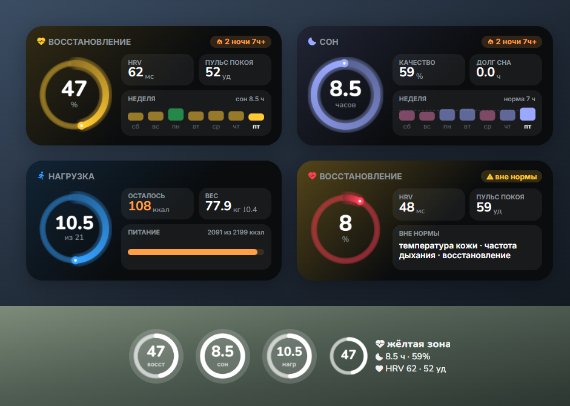
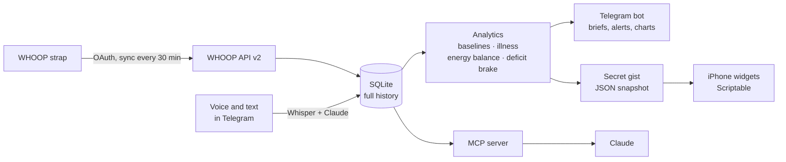
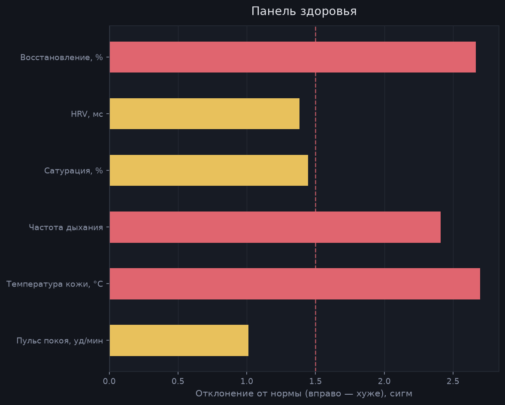
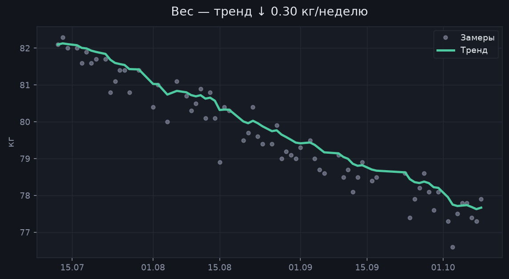

<div align="center">

# Whoop Loop

**WHOOP gives you numbers. Whoop Loop turns them into decisions.**

A personal AI health analyst on top of the WHOOP API. It spots early signs of
getting sick by comparing each night with *your own* baseline, works out your
real calorie burn instead of trusting the strap's estimate, and every morning
tells you how to run the day. The whole interface is a Telegram bot and
iPhone widgets.




<sub>Widgets on demo data: recovery, sleep, strain, alert mode, lock screen.</sub>

</div>

---

> **Language note:** the bot and the widgets currently speak Russian. An English
> interface is the top item on the roadmap — a good first contribution.

## Why

The WHOOP app shows 47% recovery — and what to do about it is up to you.
Whoop Loop answers the questions people actually buy a wearable for:

- **Am I getting sick?** Resting heart rate, skin temperature and breathing
  usually shift before the first sniffle. The bot compares them not with
  population averages but with your personal norm over the last 4 weeks.
- **How much should I really eat?** WHOOP's calorie burn has a systematic
  error. Once a week the bot checks it against your actual weight change and
  computes a correction — after 3–4 weeks the calorie target is truly yours.
- **Push hard or take it easy?** The morning brief folds sleep, recovery,
  strain and food into one recommendation.

## A morning with Whoop Loop

As soon as WHOOP has scored the night, one message arrives in Telegram
(demo data, translated from Russian):

```
Good morning. Friday, October 9

🟡 Recovery: 47% — yellow zone
   HRV 62 ms (+6 vs norm), resting HR 52 (−4 vs norm)

😴 Sleep: 8h 32m — performance 59%
   deep 1h 53m, REM 2h 03m, 9 disturbances

🍽 Today's target: 2,199 kcal (cutting)
   burn ≈ 2,749 kcal, correction factor not calibrated yet
   eaten 2,091, 108 left · protein 154/140 g
⚖️ Weight: 77.9 kg (smoothed trend 77.7, ↓ 0.40 kg/week)

Today: an ordinary day. A walk for pleasure, work without heroics,
and try to get to bed earlier than usual.
```

If the night hasn't been confirmed in the WHOOP app yet, the bot never passes
yesterday's numbers off as today's — it waits and reminds you to confirm sleep.

## What's inside

| | |
|---|---|
| 🩺 **Early illness warning** | Rules from Stanford, UCSF and WHOOP studies: resting HR two nights in a row, breathing and skin temperature vs your personal norm |
| ⚖️ **Self-calibrating calories** | Real expenditure from energy balance: intake − weight change × 7700 |
| 🛑 **Deficit brake** | On a diet and HRV is falling, resting HR rising, sleep getting worse? The bot tells you to eat more |
| 🌅 **Morning brief and bedtime plan** | What to do today; when to go to bed to recover by tomorrow |
| 🎙 **Voice diary** | "Had plov, two coffees, went to bed at 2" → a structured record (Whisper + Claude) |
| 📱 **iPhone widgets** | Home and lock screen, three pages, alert mode, streaks |
| 📈 **Charts** | PNGs right in the chat: weight, energy, recovery, sleep, health panel |
| 🤖 **MCP server** | Claude answers questions about your health from your own data |

## How it works



The bot uses long polling, so the server **opens no ports at all**. A widget
can't ask the server directly, so every 15 minutes the bot posts a short
snapshot to a secret gist and the widget reads it from there.

## How the bot detects illness



The rules come from published wearable studies. Every signal is compared with
**your** norm, not a population average.

| Signal | Rule | Source |
|---|---|---|
| Resting heart rate | **≥ 4 bpm above your personal median, two nights in a row**; one night is never an alert | Alavi et al., *Nature Medicine* 2022 — 80% of COVID-19 cases flagged at or before symptom onset, median 3 days early |
| Respiratory rate | norm = median and SD of nights 21 to 7 back; compared with the mean of the last **two** nights | Miller et al., *PLOS ONE* 2020 — WHOOP's own data; a healthy person varies by only ~0.5 breaths/min |
| Skin temperature | z-score vs a 21-day norm, mean of two nights | Mason et al., *Scientific Reports* 2022 (TemPredict) — temperature raised accuracy (ROC AUC 0.77 → 0.82) |
| HRV | a drop — supporting evidence only | Hirten et al., *JMIR* 2021; Natarajan et al., *npj Digital Medicine* 2020 |

**The decision.** 🔴 an alert needs two *independent* lines of evidence:
resting HR two nights in a row **plus** breathing or temperature, or breathing
**and** temperature together. 🟡 a watch is one strong signal, or one backed
by HRV.

**Why HRV can't confirm resting HR.** Both read the same autonomic state and
move together: on synthetic history, every false alarm came from the
"resting HR + HRV" pair. Breathing and temperature are separate channels.

**Known causes of false alarms.** Alavi et al. name alcohol, stress, intense
exercise, travel and vaccination (resting HR peaks 1–2 nights after a dose).
Pietilä et al. (*JMIR Mental Health* 2018, n = 4,098): a moderate dose of
alcohol raises sleeping heart rate by 4 bpm and a high dose by 8.7 — enough on
its own to reach the alert line. If any of these happened the evening
before, an alert is downgraded to a watch and the bot says why:

| Cause | How the bot knows |
|---|---|
| alcohol, high stress (8+/10), a trip | voice diary |
| a flight | **automatically**: WHOOP records the time zone of every night |
| a very hard workout (strain 16+) | **automatically**: WHOOP data |
| a vaccine dose | the `/vaccine` command |

**It learns from your answers.** The evening after an alert the bot asks, with
buttons: "🤒 Got sick / 😐 Something else / 🙂 Nothing happened". Got sick
without an alert? Send `/sick` — that's a missed case. `/accuracy` shows your
personal track record: how many alerts turned out to be illness and how many
illnesses were caught in advance. Synthetic data tests the logic; these
answers are the only way to know whether the detector is right for you.

**Tried and dropped: CuSum.** Alavi et al. also ran a second algorithm, CuSum,
which adds up small nightly excesses. On synthetic history (4 healthy
histories × 110 days, 5 abrupt and 4 gradual illness episodes) it caught no
episode earlier than the rules above and added a false alarm. On resting HR
alone it's noisy — 83.7% specificity in the study. So it's not part of the
decision.

**Our choices, not the studies':** the 2σ line for breathing and temperature,
−1.5σ for HRV, and the way the signals are combined. The studies show that
these signals move and that combining them helps; they don't publish a ready
rule for this exact combination on WHOOP data.

**Synthetic check:** 1 false alert (and 19 watches) in 440 healthy days;
9 alerts on 9 generated illness episodes, abrupt and gradual. That tests the
logic — it is not clinical validation. Full references are in
[`app/analytics/illness.py`](app/analytics/illness.py).

<br clear="right">

## How calorie calibration works



WHOOP estimates calorie burn from heart rate, with a systematic error. Food
logging is imprecise too. The loop doesn't fight either error head-on — it
measures the combined error and subtracts it:

1. Over two weeks it averages intake and WHOOP's burn.
2. A least-squares slope through the weigh-ins gives the real change in mass.
3. Energy balance gives the real expenditure:
   `TDEE = intake − slope × 7700`.
4. The factor `TDEE / WHOOP_burn` feeds next week's target.

After 3–4 weeks the factor converges and the accuracy of individual
estimates stops mattering — only the stability of the error does. The factor
is clamped to 0.75–1.25: going outside that means leaky logging, not an
amazing metabolism.

<br clear="right">

## Try it in 2 minutes — no WHOOP needed

Demo mode generates 4 months of plausible history, including the onset of an
illness so you can see an alert:

```bash
git clone https://github.com/omertaevalibekai/whoop-loop.git
cd whoop-loop
python -m venv .venv
.venv/Scripts/python -m pip install -r requirements.txt   # Linux/macOS: .venv/bin/python

python cli.py demo --days 120 --with-illness
python cli.py digest      # the morning brief
python cli.py charts      # charts into charts/
python cli.py widget show # the data a widget would get
```

Demo data goes into the same database — delete `data/whoop.db` before a real
run.

## Setup with a real WHOOP

```bash
cp .env.example .env
```

| Variable | Where to get it | Required |
|---|---|---|
| `WHOOP_CLIENT_ID`, `WHOOP_CLIENT_SECRET` | [developer.whoop.com](https://developer.whoop.com) → Create App, redirect URI `http://localhost:8000/callback` | yes |
| `TELEGRAM_BOT_TOKEN` | @BotFather | yes |
| `TELEGRAM_CHAT_ID` | the bot binds the first chat that sends `/start`; can be set explicitly | no |
| `ANTHROPIC_API_KEY` | console.anthropic.com | no — without it the diary is parsed with rules |
| `OPENAI_API_KEY` | platform.openai.com | no — without it voice messages are off, text works |
| `WIDGET_GITHUB_TOKEN` | GitHub → Settings → Tokens (classic), `gist` scope only | no — needed for widgets |

The WHOOP app needs these scopes: `offline`, `read:recovery`, `read:cycles`,
`read:sleep`, `read:workout`, `read:profile`, `read:body_measurement`.

Run:

```bash
python run_api.py    # WHOOP OAuth callback and webhooks, port 8000
python run_bot.py    # Telegram bot and scheduler
python cli.py auth   # link to connect WHOOP
```

After authorization a year of history loads in the background. Then send
`/start` to the bot.

### Bot commands

| Command | What it does |
|---|---|
| just a number (`82.4`) | log weight |
| a voice message or text | parse food, alcohol, coffee, stress |
| `/today` · `/digest` | current state · morning brief |
| `/health` | health panel and illness risk |
| `/sick` · `/vaccine` · `/accuracy` | I'm sick · vaccine today · how well the detector works for me |
| `/night` | when to go to bed and what tomorrow looks like |
| `/guard` · `/week` | deficit brake · weekly calibration |
| `/charts` `/weight` `/energy` `/recovery` `/sleep` | charts |
| `/goal cut 0.5` · `/protein 150` · `/eat 650 plov` | goal, protein, manual food entry |

### iPhone widgets

1. Set `WIDGET_GITHUB_TOKEN` and run `python cli.py widget setup`. The bot
   creates a secret gist and prints a link to a ready-made script.
2. Install [Scriptable](https://apps.apple.com/app/scriptable/id1405459188),
   create a script and paste the contents of the link.
3. Add a Scriptable widget. The widget parameter picks the page: empty —
   recovery, `sleep` — sleep, `body` — strain and nutrition. Stack three
   widgets and swipe between them.

The phone pulls the widget code by itself once an hour: after editing
`widget/`, `python cli.py widget scripts` is enough. To see the widgets
without a phone, open `widget/preview/index.html` — a Scriptable emulator in
the browser.

### MCP for Claude

```bash
claude mcp add whoop -- /path/to/whoop-loop/.venv/bin/python /path/to/whoop-loop/run_mcp.py
```

Tools: `whoop_status`, `whoop_digest`, `whoop_metric`, `whoop_illness_check`,
`whoop_deficit_guard`, `whoop_energy`, `whoop_workouts`, `whoop_diary`,
`whoop_sql` (SELECT only). Ask Claude "how does coffee after 4 pm affect my
deep sleep?" — and it will work it out from your database.

## Deploying to a server

```bash
./deploy/deploy-systemd.sh opc@<server-ip>
```

The script targets a free Oracle Cloud machine (1 GB RAM): it installs
Python 3.11, adds swap, copies the code and `.env`, on the first run moves the
database together with the WHOOP token, and starts a systemd service. The SSH
key path comes from the `SSH_KEY` variable or `deploy/local.env`.

<details>
<summary>Why this way and not Docker</summary>

- **Docker doesn't fit.** The daemon plus an image build with
  numpy/matplotlib won't squeeze into 1 GB.
- **Heavy steps knock out SSH.** `dnf` and `pip` push the machine so deep into
  swap that it stops answering. `ssh host "long command"` times out while the
  remote command keeps running — and a retry collides with it. So heavy steps
  run detached (`setsid nohup`) and are polled from outside.
- **pip installs packages one at a time.** Memory goes not on any single
  wheel but on resolving the whole requirements file at once.

</details>

## Privacy and security

- **Your data stays with you.** The history lives in a local SQLite file. The
  only outbound calls go to WHOOP, Telegram and — if enabled — voice
  transcription (OpenAI) and diary parsing (Anthropic).
- **The bot answers only its owner.** The first chat to send `/start` becomes
  the owner; everyone else gets no reply at all, not even to `/start`.
- **The gist link is a secret.** A secret gist doesn't show up in search, but
  anyone with the link can see the snapshot. The repository holds no links:
  widget scripts carry placeholders, and real addresses are filled in only
  when they're uploaded.
- **No open ports** in production.

## FAQ

**Is this a medical device?**
No. It's a personal tool that shows deviations from your own norm. It doesn't
diagnose anything; if you feel unwell, see a doctor, not a bot.

**Does it work without a WHOOP?**
Demo mode — fully. Real data needs a WHOOP and an app at developer.whoop.com
(free).

**Why Telegram instead of a native app?**
Telegram is already on your phone, handles voice, buttons and images, and
delivers notifications without an app store.

**Is there an English version?**
Not yet — the bot speaks Russian. Translating it is a great first
contribution.

**What does it cost?**
The server is free Oracle Cloud. OpenAI and Anthropic are only needed for
voice and diary parsing — pennies a month for personal use.

## Roadmap

- [ ] English bot interface
- [ ] Validate thresholds on real illness episodes from users (with consent)
- [ ] Sleep vs calendar: which meeting-heavy days hit recovery hardest
- [ ] A large widget with two weeks of HRV and resting HR
- [ ] PDF report export for your doctor

## Contributing

Issues and pull requests are welcome. Before a PR:

```bash
pip install pytest && python -m pytest -q
python cli.py demo --days 120 --with-illness && python cli.py digest
```

New analytics go in `app/analytics/`, one job per module. If you change the
illness detector's thresholds, say in the PR what data you checked them on.

## Project layout

```
app/
  whoop/       OAuth, API client, sync
  analytics/   baselines, illness, energy, deficit brake, brief, charts
  diary/       voice transcription, structured parsing
  bot/         Telegram bot (and the owner-only guard)
  api/         FastAPI: OAuth callback and webhooks
  widget.py    widget snapshot and gist upload
  mcp_server.py
widget/        Scriptable scripts and a preview emulator
deploy/        deploying to a small server without Docker
cli.py
```

## License

[MIT](LICENSE). WHOOP is a trademark of WHOOP, Inc.; this project is not
affiliated with it.
